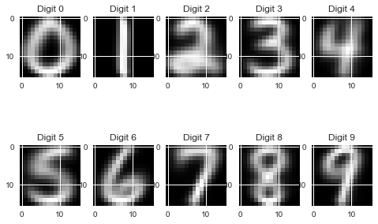
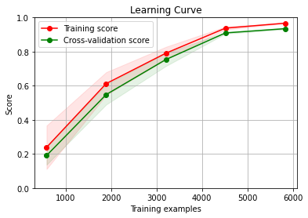

# Optical Digit Recognition & Classification

## Overview
This repository contains the implementation of an Optical Character Recognition (OCR) system designed to identify handwritten digits (0-9). The project was developed as part of the **Pattern Recognition** course at **NTUA**.

The goal was to build, evaluate, and compare various classifiers—ranging from simple Euclidean distance metrics to Deep Neural Networks—using the **US Postal Service (USPS)** dataset.

## The Dataset
The dataset consists of handwritten digits scanned from envelopes by the US Postal Service.
* **Format:** Grayscale images of 16x16 pixels.
* **Features:** Each sample is a vector of 256 intensity values (features) + 1 label (the digit 0-9).
* **Structure:** Data is split into training and testing sets.

## Methodology & Features

### 1. Data Analysis & Visualization
* Data parsing and reshaping into 16x16 images.
* Visualization of random samples per class.
* Calculation of pixel-wise Mean and Variance to understand class distributions.

<p align="center">
  
</p>

### 2. Custom Classifier Implementations
Unlike standard library calls, this project involved implementing algorithms from scratch to understand the mathematics behind them:
* **Euclidean Classifier:** Classification based on the minimum Euclidean distance from the class means (Centroids).
* **Naive Bayes Classifier:** Custom implementation calculating *a priori* probabilities, class means, and variances. Evaluated against Scikit-Learn's `GaussianNB`.

### 3. Comparative Analysis
We compared the performance of several models using Scikit-Learn:
* **k-Nearest Neighbors (k-NN)**
* **Support Vector Machines (SVM)** with various kernels (Linear, RBF).
* **Naive Bayes** (Gaussian).

### 4. Ensemble Learning
To improve accuracy, we combined classifiers using:
* **Voting Classifiers:** Hard and Soft voting mechanisms.
* **Bagging:** Creating ensembles (e.g., Random Forest logic) to reduce variance.

### 5. Deep Learning (PyTorch)
* Implementation of a **Fully Connected Neural Network** (FCNN) using PyTorch.
* Custom `DataLoader` implementation for batch processing.
* Training loop with Train/Validation splits and non-linear activation functions.

<p align="center">
  
</p>

## Project Structure

```text
├── data/
│   ├── test.txt          # Testing dataset
│   └── train.txt         # Training dataset
├── final/
│   ├── pat_rec_1st_project.py  # Main execution script
│   └── pat_rec_functions.py    # Custom classifier implementations & helpers
├── images/               # Plots and visualizations
├── README.md             # Project documentation
└── requirements.txt      # Dependencies
```